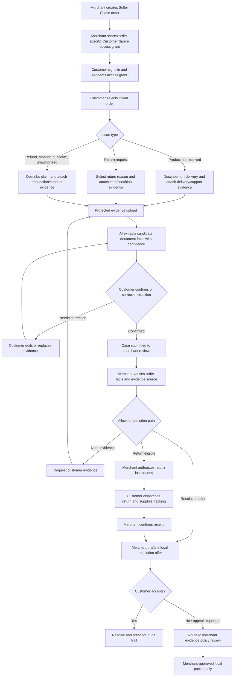

# Customer Space: Evidence-Assisted Issues, Returns, and Resolution

## Purpose and scope

Customer Space extends DisputeShield from a merchant-only evidence console into a **two-sided, controlled case workflow**. A buyer can securely open a local issue about their own Seller Space order, submit return or non-delivery evidence, review AI-assisted document extraction, and follow the status of a merchant-managed resolution.

The product’s primary merchant-loss workflow remains **product not received**. Return, refund, wrong-amount, duplicate-payment, and unauthorized-transaction paths use the same evidence discipline but are explicitly handled as local customer cases. They are not represented as Razorpay disputes unless a real, independently raised Razorpay dispute is received through the verified integration path.

> OCR is an evidence-extraction aid. It does not prove delivery, authorize a return, issue a refund, determine fraud, or submit an external dispute response.

## Access and privacy model

Customer Space uses an authenticated buyer identity plus a high-entropy, order-specific access grant. The access grant can bind to the first authenticated buyer identity that redeems it; subsequent requests must match that identity. An order reference by itself never grants access to an order, case, shipping address, document, or merchant record.

| Actor | Can do | Cannot do |
| --- | --- | --- |
| Customer | View their bound order, open one or more scoped local issues, upload permitted evidence, review OCR extraction, correct/confirm extracted facts, accept a merchant resolution | Browse merchant records, access another buyer’s order, force a refund, submit a Razorpay dispute, see merchant-only risk scores or other customer documents |
| Merchant | View cases belonging to their orders, request evidence, authorize or reject a return with a reason, prepare a resolution offer, release permitted local packets | Read cases belonging to another merchant, alter customer-uploaded originals, auto-refund, auto-submit an external appeal, call an OCR field verified without review |
| Automation | Classify document type, extract structured candidate facts, compare candidates with the linked order, create evidence gaps and safe next steps | Treat OCR as truth, infer missing facts, make an irreversible decision, issue financial actions, submit an external dispute or appeal |

## End-to-end business flow

## Case states and allowed transitions

Every transition records actor, reason, UTC timestamp, source references, and a machine-readable event type. The workflow rejects out-of-order transitions rather than silently correcting them.

| State | Who can enter it | Entry conditions | Safe next states |
| --- | --- | --- | --- |
| `draft` | Customer | Customer has a bound order | `evidence_pending`, `submitted`, `withdrawn` |
| `evidence_pending` | Customer or system | Required evidence is absent or OCR is unconfirmed | `draft`, `submitted`, `withdrawn` |
| `submitted` | Customer | Claim statement accepted; all mandatory acknowledgements complete | `merchant_review`, `customer_action_required` |
| `customer_action_required` | Merchant | Merchant requests a specific missing item or clarification | `evidence_pending`, `merchant_review`, `withdrawn` |
| `merchant_review` | Merchant | Order and linked documents are available for review | `return_authorized`, `resolution_offered`, `local_policy_review`, `customer_action_required`, `closed` |
| `return_authorized` | Merchant | Return is applicable and merchant supplied truthful instructions | `return_in_transit`, `resolution_offered`, `closed` |
| `return_in_transit` | Customer | Customer provides a tracking reference or shipment proof | `return_received`, `customer_action_required` |
| `return_received` | Merchant | Merchant records receipt after independent review | `resolution_offered`, `closed` |
| `resolution_offered` | Merchant | Offer is recorded as a local proposed outcome, never a performed money action | `resolved`, `merchant_review`, `closed` |
| `local_policy_review` | Merchant | Customer has asked for a review and evidence is prepared | `resolution_offered`, `closed` |
| `resolved` / `closed` / `withdrawn` | Role-specific | Terminal reason is recorded | Terminal |

## Issue-specific policy gates

| Issue type | Required system checks | Automation output | Prohibited automated action |
| --- | --- | --- | --- |
| Product not received | Match order, payment observation, fulfillment record, delivery proof, and address evidence | Missing-evidence checklist and merchant review recommendation | Declaring non-delivery as fact, issuing refund, lodging dispute |
| Return request | Confirm item/order relationship and requested return reason | Return-readiness checklist | Issuing label, authorizing return, refunding |
| Refund issue | Inspect local/API payment and merchant refund record separately | Refund-proof gaps and request to merchant | Declaring a refund processed or reversing payment |
| Wrong amount | Compare customer claim with stored order amount and supported transaction evidence | Amount comparison summary | Altering an order or payment |
| Duplicate payment | Compare payment references and timestamps | Duplicate-reference checklist | Refunding either payment |
| Unauthorized transaction | Require a customer statement and relevant transaction evidence | Human-review escalation plus evidence gaps | Fraud determination, account restriction, external chargeback submission |

## OCR and document integrity flow

Customer documents are uploaded through a protected, case-scoped server procedure. The service accepts only a small allowlist of image and PDF types, enforces a byte limit before persistence, calculates a SHA-256 digest, and writes the original file only to object storage. The database stores metadata, ownership, content type, size, digest, extraction result, per-field confidence, and customer confirmation state; it never stores file bytes.

The extraction response is structurally constrained. It may identify a candidate document type, named merchant, order reference, payment amount, currency, date, tracking reference, and supporting/contradicting observations. Each extracted field carries a confidence score. Low-confidence, absent, conflicting, or order-mismatched fields are highlighted as review tasks. The original is immutable; a corrected customer value is stored as a separate attestation rather than overwriting OCR output.

The customer must either **confirm**, correct, or reject an OCR extraction before it can be included in a submitted case. Merchant review is separately required before any field becomes merchant-verified. OCR never changes an order, fulfillment state, payment status, refund ledger, or dispute status.

## Return receipt and refund-preparation gate

A customer may mark an authorized return **in transit**, but that assertion does not establish that the merchant has received the item. A return reaches `return_received` only after one of two independently labelled receipt sources is recorded:

| Receipt source | What DisputeShield records | Refund-preparation effect |
| --- | --- | --- |
| Signed carrier integration event | Carrier event identifier, carrier/tracking reference, signature-verification status, and receipt time | May meet the carrier-evidence part of the refund gate |
| Merchant-confirmed delivery-partner mobile record | Carrier/tracking reference, non-sensitive delivery-partner contact suffix, merchant attestation, and receipt time | Is labelled **merchant confirmed**, not carrier verified; it may support human refund preparation but never proves an external carrier event |

The system checks a return request’s state, the receipt record, the linked Razorpay payment’s captured status, and the merchant’s explicit approval phrase before it can create a **local refund request**. The local request is only `prepared` and then `merchant approved`; it does not invoke Razorpay’s refund API, send money, or claim that a refund has succeeded. A separate Razorpay API or signed webhook confirmation is required before any UI can show a Razorpay refund as confirmed.

The existing immutable `customerCaseEvents` record for the customer action `mark_return_in_transit` is the persisted return-dispatch assertion. It remains distinct from the merchant’s immutable `merchant_confirmed_return_receipt` event. A local refund request advances to `razorpay_confirmed` only when the project receives a validly signed Razorpay `refund.processed` webhook for a merchant-approved request; the merchant interface cannot set that state.

## Visual verification record

The unauthenticated Customer Space entry screen renders both private access routes: a **catalog token** path for customer-initiated browsing and explicit checkout, and an **order token** path for an existing buyer order’s issue/return workflow. The merchant home correctly keeps Customer Space summaries locked when the merchant workspace is not authenticated. This boundary is intentional; an owner-session verification is still required before validating live merchant return controls.

Authenticated Seller Space verification subsequently confirmed the server-scoped owning merchant workspace: one active product, one local order, an API-observed Razorpay capture, the delivery-exception merchant record, and the new private catalog-token and order-token controls render only after identity confirmation. No catalog token was generated and no payment, refund, or dispute action was executed during this check.

In the subsequent non-financial access check, the merchant created one fresh private catalog token. Its value is intentionally not retained in project documentation or messages. The control reported a seven-day expiry and clearly stated that browsing does not create an order or payment. The next check is limited to redeeming the token in the authenticated Customer Space; Checkout will not be opened.

The same authenticated browser reached Customer Space and accepted the token as input. No lookup ran until the buyer explicitly selected **Open catalog**, and no checkout control was invoked at this stage.

The private catalog redemption then completed successfully for the signed-in identity. Customer Space showed exactly one merchant-scoped active product, quantity selection, price, a deliberately separate **Buy with Razorpay** control, and an explicit notice that capture and fulfilment stay separate from browser Checkout state. The Checkout control was not selected, so this validation created no payment, order, refund, or external dispute.

During a subsequent Seller Space navigation, the product/order controls briefly rendered their empty state while protected queries revalidated. A follow-up view resolved to the same server-confirmed merchant workspace and correctly restored the one product and one local order. This is a presentation-stability issue under investigation, not a cross-tenant data exposure; no action was enabled during the transient state.

After adding the revalidation guard, an authenticated refresh retained the owner’s one product and one selected local order without displaying the false empty workspace. The merchant then generated an order-specific Customer Space token for the existing API-observed order. The token value is not retained outside the controlled browser session; generating it neither opened Checkout nor changed payment, fulfilment, refund, or dispute state.

Customer Space returned to its access screen with distinct catalog and order token inputs. The test intentionally moved to the order-token control for the existing order; it did not activate the catalog Checkout option.

The order token was entered into the authenticated Customer Space order-access control and submitted. The page correctly entered a protected **Checking access** state before revealing any order, customer, fulfilment, evidence, or payment information.

The private order context then opened successfully for the same authenticated identity. It displayed the bound order reference, product and amount, client-confirmed payment observation, a separately labelled merchant delivery-exception record, access expiry, and the six supported local issue paths. No customer case, document, OCR extraction, return event, refund request, payment, or dispute was created because no truthful customer claim or supporting document was supplied for this verification.

The corrected Seller Space view was then reloaded in the authenticated browser. It first showed the explicit **Synchronizing catalog and order data** state rather than a false empty workspace, then resolved to the merchant’s one product and one order. This confirms the UI now waits for matching protected query results instead of displaying stale empty cache data as an account state.

The authenticated merchant home was also rechecked after its initial auth hydration. It displayed the local Customer Space handoff and return-receipt lane as empty, which is correct because no truthful customer case has been submitted. The existing Seller Space `LOCAL-30001` product-not-received review rendered only once, with the delivery-exception readiness state, bounded appeal policy score, source-labelled evidence gaps, blocked external actions, and the merchant approval gate. No customer case or payment/refund action was created during this check.

## Complete operating flow

| Step | Actor | State or event | Source label | What the automation may do | What it must not do |
| --- | --- | --- | --- | --- | --- |
| 1 | Merchant | Creates a private catalog token | Merchant authorization | Bind the token to the first authenticated buyer and show only that merchant’s active local products | Expose other customers, orders, evidence, or merchant secrets |
| 2 | Buyer | Browses catalog and selects a product | Local merchant catalog | Check the displayed local inventory and prepare a Razorpay order only after the buyer presses the checkout control | Treat browsing as an order, reserve stock as captured inventory, or charge a buyer silently |
| 3 | Buyer + Razorpay | Hosted Checkout returns a callback | Browser callback plus server signature check | Verify the Checkout signature and bind a local order-access token to that buyer | Treat a browser callback as Razorpay capture, shipment, delivery, refund, or a dispute |
| 4 | Razorpay | `payment.captured` event or payment API observation | Signed webhook or Razorpay API | Update the relevant payment fact with its own provenance | Conflate API observation with signed-webhook verification |
| 5 | Buyer | Opens issue or return request | Customer local case | Create a case draft, identify the claim type, and explain evidence requirements | Create a Razorpay dispute, chargeback, return label, or refund |
| 6 | Buyer | Uploads a document | Protected customer case evidence | Retain the original under a case-scoped key; extract OCR candidate fields and confidence | Modify the original, treat OCR as proof, or publish documents across tenants |
| 7 | Buyer | Confirms or rejects OCR candidate facts | Customer confirmation | Record the confirmation state and expose uncertainty to the merchant | Auto-verify facts or change payment, delivery, or refund status |
| 8 | Merchant | Starts factual review and authorizes a return | Merchant record | Route the return case through the constrained state machine | Issue a refund automatically or call Razorpay without deliberate approval |
| 9 | Buyer | Marks return in transit | Immutable customer case event | Preserve the dispatch assertion and request supporting tracking evidence | Treat the buyer statement as merchant receipt |
| 10 | Carrier or merchant | Return is received | Signed carrier event, or clearly labelled merchant-confirmed partner record | Record source, tracking reference, receipt time, and only a mobile suffix when used for merchant verification | Claim a merchant record is a signed carrier integration event |
| 11 | System | Local refund request is prepared | Receipt record + Razorpay API capture fact | Check that the case is a return, item receipt is recorded, a payment reference exists, and Razorpay API currently reports capture | Issue a refund, alter the original payment, or represent preparation as money moved |
| 12 | Merchant | Approves local refund request | Merchant phrase gate | Store the explicit approval and create an audit event | Invoke the Razorpay refund API from this approval alone |
| 13 | Razorpay | `refund.processed` arrives with a valid signature | Signed webhook | Move a merchant-approved local request to `razorpay_confirmed` and retain the refund ID | Confirm a refund from an unsigned event, a UI click, or any other status |

### Failure and stop conditions

| Condition | System behavior |
| --- | --- |
| Catalog token is expired, invalid, or bound to another buyer | Deny access without revealing catalog, order, or merchant details. |
| Buyer closes Checkout or signature verification fails | Retain no captured-payment claim. The order may show checkout opened or verification failed, but cannot enter the issue flow as a paid order. |
| OCR extraction fails, is low confidence, or is rejected | Preserve the original and route the document to human review; no claim or financial state changes. |
| Return receipt is absent | Keep the case out of `return_received` and block local refund preparation. |
| Payment reference is absent or Razorpay API does not report capture | Block local refund preparation; merchant sees the reason rather than a refundable status. |
| Merchant phrase is absent or wrong | Keep the local request in `prepared`; no money action is available. |
| Signed Razorpay refund event is absent | Keep the request at `merchant_approved`; never say the customer has been refunded. |

## Current dispute-operating context

The universal workflow groups customer issues by their operational remedy rather than treating every complaint as fraud or a chargeback. Razorpay’s guidance identifies common dispute categories including unauthorized transactions, goods or services not received, defective or not-as-described goods, duplicate processing, incorrect amounts, and credits/refunds not processed. It also emphasizes that reason codes provide a starting taxonomy but can fail to capture the actual trigger, so this workflow preserves the customer’s statement and evidence rather than relying on a category alone. [1] [2]

For real chargebacks, the issuing bank and network decide the outcome; Razorpay relays a merchant’s evidence through the acquirer. This is why DisputeShield’s customer cases remain **local resolution workflows** until a signed external dispute event exists. Delivery records, invoices, transaction references, and customer communication are treated as specific evidence sources, while OCR output remains a customer-confirmed candidate rather than proof. [1] [3]

The trend-aware layer must identify **merchant operational patterns**, such as repeated delivery exceptions, refund delays, duplicate-billing reports, or incomplete evidence coverage. It must never label a buyer as fraudulent, infer intent, or automatically penalize a customer. Any potentially harmful financial or external action remains merchant-controlled.

### References

[1] [Razorpay, “Chargeback: What is It, Types & Prevention”](https://razorpay.com/blog/chargebacks/)

[2] [Razorpay, “The Ultimate Guide to Chargeback Reason Codes”](https://razorpay.com/blog/chargeback-reason-codes/)

[3] [Razorpay, “What Is Chargeback Fraud? A Guide for Businesses”](https://razorpay.com/blog/what-is-chargeback-fraud/)

## Automation boundaries

Automation may: create a document checklist, extract document candidates, compare candidates to the linked order, flag missing or contradictory evidence, prepare a factual draft, and route the case to a human merchant.

Automation may not: send a Razorpay dispute response, file an appeal, issue/refund money, authorize a return, modify payment or fulfillment data, send customer notifications without a documented trigger, or expose another customer’s data.

## Truthful demonstration path

The initial demonstration will use an existing merchant-owned Seller Space order and a local, authenticated Customer Space claim. It will show the full order → customer claim → protected evidence → OCR candidate facts → customer confirmation → merchant review chain. It will remain visibly labelled **local case / not submitted to Razorpay** unless a real Razorpay event independently arrives through the existing verified webhook path.

In the latest buyer-space visual check, the authenticated pre-token storefront correctly showed the private catalog and private-order routes with no purchase control active. A previously issued catalog credential did not pass the client-side length guard, so no protected catalog lookup, order creation, payment, refund, case, document, or dispute action was triggered. The credential value is intentionally not recorded. A new merchant-issued token is required to complete the updated buyer order-centre visual validation.

The authenticated merchant subsequently issued a fresh seven-day private catalog credential. The merchant workspace remained scoped to one product and one existing order, and the action created only an access grant. It did not open Checkout, alter the existing Razorpay payment observation, change fulfilment, create a customer order/case, prepare a refund, or create a dispute. The credential value is intentionally not retained in project files or user-facing messages.

The authenticated buyer then redeemed the fresh catalog credential. Customer Space displayed exactly one active merchant-scoped product, quantity selection, a deliberately separate **Buy with Razorpay** control, and the updated **My private order centre**. The order centre correctly showed zero buyer-owned orders for this identity rather than exposing the merchant’s existing local order, which validates the buyer-order isolation boundary. Checkout was not selected; no buyer order, payment, refund, customer case, document, carrier event, or external dispute was created.

With explicit user authorization, the buyer selected **Buy with Razorpay** once for the ₹799 product. The application created buyer-bound local order `CS-625F8A0012` and opened the hosted checkout boundary. The checkout then closed without a verified signature or captured-payment event; the user interface showed `Checkout closed. No payment was treated as captured.` The buyer Order Centre displayed one order with checkout status **Checkout opened**, fulfilment **unfulfilled · merchant record**, and no local issue. No refund, return receipt, customer document, case, carrier event, or Razorpay dispute was created. This validation confirms that buyer-order creation and checkout launch are separate from server-verified client confirmation, Razorpay API capture observation, signed webhook confirmation, and fulfilment facts.

Immediately after that buyer-side check, Seller Space showed its intentional **Synchronizing catalog and order data** guard while the protected merchant queries revalidated. The guard exposes no empty-state actions or records while data is incomplete; the final merchant order-list result is recorded only after the scoped queries finish.

The merchant workspace then resolved to one product and three local orders. It listed `CS-625F8A0012` as **Checkout Opened**, alongside an earlier checkout-opened local order and the existing API-observed captured Seller Space order. For `CS-625F8A0012`, the selected order truth layer showed a Razorpay order reference, **Payment: checkout opened / No capture inferred**, and **Fulfilment proof: unfulfilled / Merchant shipping record pending**. This independently confirms that the checkout attempt did not increase the API-observed captured-order count, make delivery claims, or make any refund/dispute state appear.

The Buyer Order Centre now also applies a defense-in-depth in-memory scope check after the database query. A mixed result cannot expose an order unless both its merchant and buyer identity match the authenticated catalog grant. Its local-resolution summary is likewise attached only when the case matches that same order, merchant, and buyer. The ordered source mapping remains explicit: local creation, browser checkout opened, verified Checkout signature, Razorpay API observation, and signed webhook verification are distinct states. Deterministic coverage verifies the filter, case isolation, and non-escalation of payment-source labels.

Together, the authenticated non-financial catalog redemption, merchant-scoped catalog-cache coverage, and buyer-order mixed-result regression establish the non-financial access boundary: browsing by itself does not create a payment or order; a buyer cannot receive another buyer’s order or resolution summary; and a merchant-scoped catalog key cannot be reused as another merchant’s catalog result. This is deterministic application coverage plus one authenticated browser validation, not an assertion that a second human buyer account was manually exercised in the browser.

Customer-case safety coverage now includes an additional ownership guard for buyer-visible documents. The database predicates remain the primary access control, and the server rechecks that each returned document’s merchant and buyer match the access-bound order before rendering or confirming it. Deterministic tests cover the matched and mismatched identities, unreviewed OCR evidence remaining in `evidence_pending`, legal case-state transitions, and the fact that refund or external-dispute actions are not valid case transitions. These safeguards do not create or modify a customer document, case, return, refund, payment, carrier event, or external dispute.

After the guard update and service restart, the authenticated Customer Space entry screen rendered normally with its catalog-token and order-token controls, the source-boundary notice, and no exposed catalog, order, document, or case content before an access credential was entered. No token redemption, Checkout launch, case intake, document upload, return, refund, carrier, or dispute action occurred in this post-restart check.

The automated non-financial boundary test now protects the same contract in source: catalog browsing, local case intake, document upload/OCR confirmation, merchant case updates, and merchant-confirmed return receipts must not contain a Razorpay payment or refund action. Local refund preparation may perform only a read-only payment lookup to confirm capture; merchant approval records a local state and cannot call a Razorpay refund write. This complements the deterministic policy and webhook tests and does not synthesize any customer record or financial event.

Implementation reconciliation confirmed that the responsive Customer Space includes a private catalog and buyer Order Centre, order-token lookup, source-labelled checkout and fulfilment strip, issue-specific local case intake, protected evidence upload, optional Gemini candidate extraction with customer confirmation, case status controls, return/refund truth layer, and immutable event timeline. The merchant home contains a separate **Customer Space handoff** and case workspace with local-only labels, review actions, receipt provenance, refund-readiness steps, and an explicit no-financial-action boundary. This verifies shipped UI and safe entry rendering only; an end-to-end case, document, carrier, or refund workflow still requires truthful evidence or separate authorization.

The customer case timeline now also renders dedicated return/refund provenance facts. It differentiates a signature-verified carrier event from a merchant-confirmed delivery-partner record, keeps prepared and merchant-approved refund requests explicitly local with no-money-moved language, and reserves an externally confirmed refund label for the signed `refund.processed` webhook state. This rendering is covered for receipt, prepared, approved, and confirmed paths without creating a case or financial event.

In the authenticated browser, the Customer Space entry rendered its private catalog and order-token controls together with the universal local-evidence boundary: no local case, document, carrier event, payment, return label, refund, or Razorpay dispute is created merely by entering the space. The merchant home rendered the separate Customer Space handoff card and its explicit local-case/no-automatic-external-action explanation. At the first observation, its protected customer-case summary remained locked pending merchant-workspace confirmation, so no local case data was viewed or changed. These entry-state checks are non-mutating and do not substitute for a truthful customer-case lifecycle.

After the merchant workspace resolved, the handoff correctly showed **No submitted Customer Space cases**, the Universal resolution signals panel showed **0 local cases** and its non-profiling boundary, and the return/refund panel showed no customer return in transit. The existing Seller Space demonstration remained visibly separate as a local product-not-received review with a human-review policy block, delivery-exception next step, and no automatic response/refund/external appeal. No buyer claim, document, carrier event, payment, return, refund, or dispute was created, edited, or submitted during this interface check.

Responsive mobile entry rendering was also checked at a 375 px viewport. Customer Space showed its catalog and order-token boundaries without redemption; Seller Space showed the synchronization guard rather than false records; and Payments showed no-auto-charge, explicit Checkout, three-stage verification, and empty ledger states. These are entry-state/mobile layout checks only. A mobile captured-payment state, a live payment failure, and a mobile reauthentication transition remain separate pending validations.

The deterministic synthetic Customer Space workflow now covers a buyer-bound return request without creating persistent test records. It asserts buyer/merchant scope isolation, keeps an unreviewed OCR candidate in `evidence_pending`, moves only reviewed evidence through customer submission and merchant review/return authorization/receipt, records a merchant-confirmed return source, and keeps a prepared refund request local with no-money-moved language. Refund and external-dispute transitions remain prohibited. This is synthetic regression coverage, not a claim that a real customer or carrier event occurred.

## Explicitly labelled local validation fixture — 23 August 2026

With user authorization, one isolated local fixture was created through a legacy direct application-data script: `LOCAL-SYN-69C2A9619F` linked to `SYNVAL-69C2A9619F`. Its case statement, order label, document name, extraction model, and immutable events each state **SYNTHETIC LOCAL VALIDATION ONLY** or **NOT CUSTOMER EVIDENCE**. The merchant handoff rendered it as a local **Return request**, with one confirmed synthetic document, no OCR review pending, a receipt state of pending, no local refund request, and a visible no-financial-action boundary. The aggregate signal correctly remained an operational return-friction pattern rather than a customer score. Because this legacy fixture bypassed normal protected procedure orchestration, it is **not** evidence of a customer-facing product flow and must not be used as such.

No Razorpay order, payment, capture, webhook, refund, carrier event, return label, or external dispute was created. The fixture is only an isolated validation path for the local intake/OCR-confirmation/handoff state contract and must never be used as customer evidence or a financial-action trigger.

### Protected procedure fixture — pending browser handoff verification

The owner-only protected fixture harness then invoked the same guarded server procedures used by Customer Space: it created a synthetic validation order, created case `CS-BF601B1E4D` for order `SYN-UI-000328C1E0`, uploaded protected synthetic image document `30001`, obtained and confirmed an OCR candidate, submitted the case, and started merchant review. Each request carried the explicit **SYNTHETIC LOCAL VALIDATION ONLY** acknowledgement and the case statement expressly prohibits financial or external use. The resulting case state was `merchant_review`.

This is stronger evidence of the protected product contract than the legacy direct-data fixture because it exercised the real guarded procedures and their state transitions. It is still **not browser-flow evidence**: the Customer Space control and merchant handoff for this protected case require a separate visual verification. Neither fixture created a Razorpay payment, refund, carrier event, or external dispute, and neither may be presented as proof that a bank-initiated chargeback occurred.
